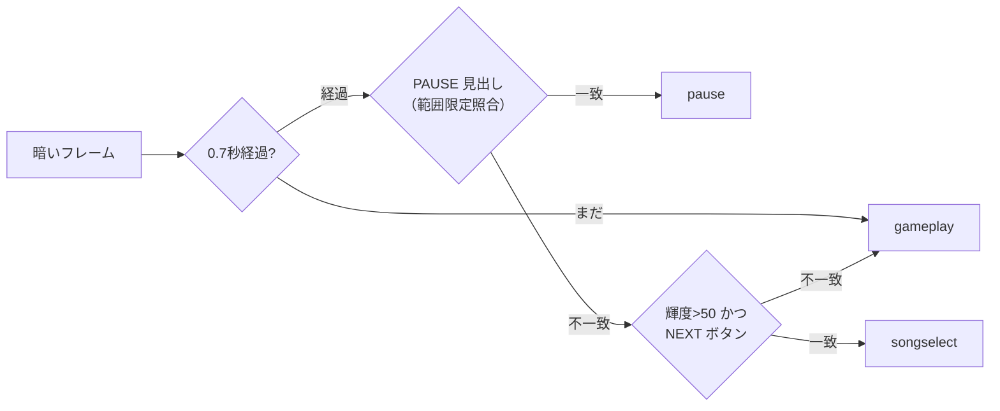
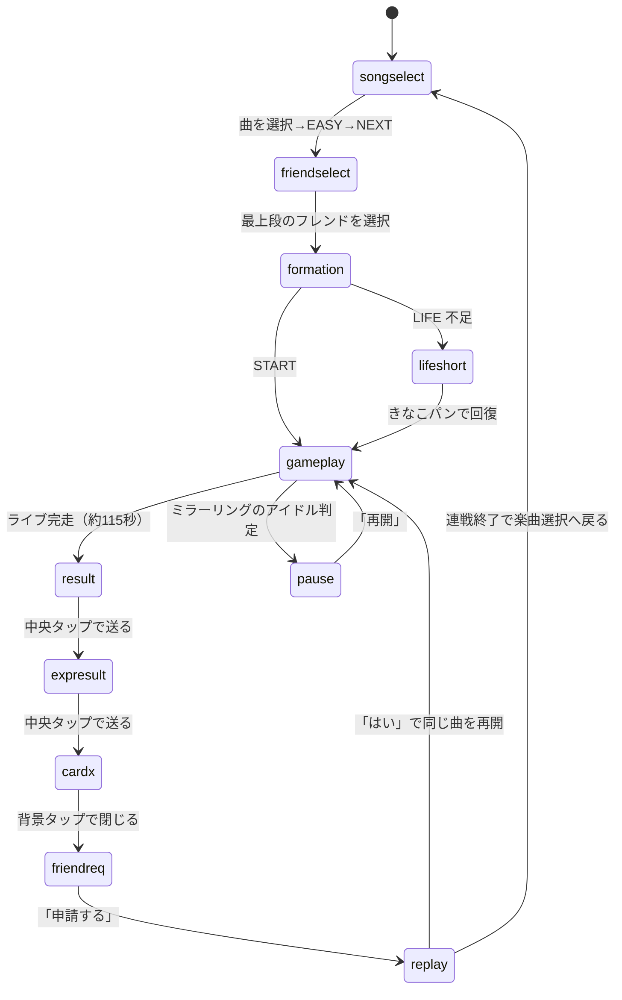
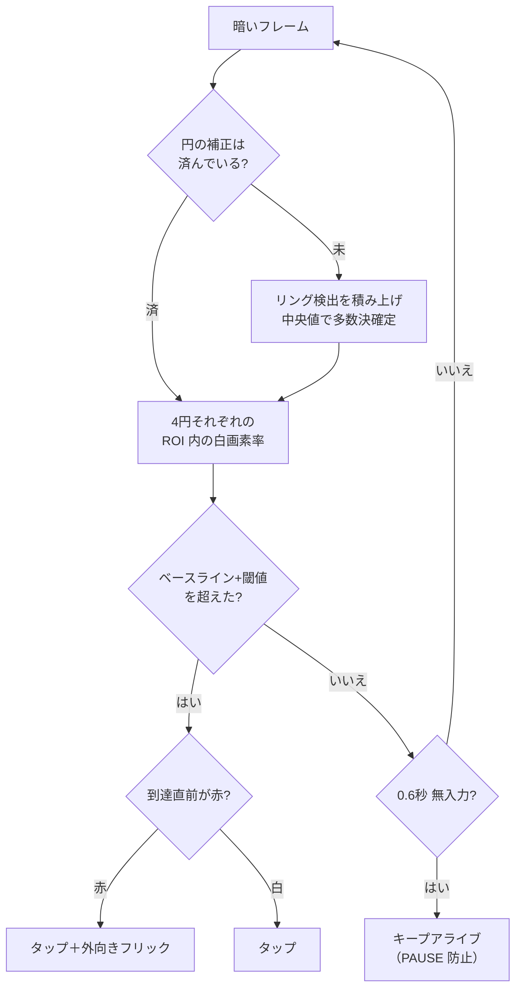
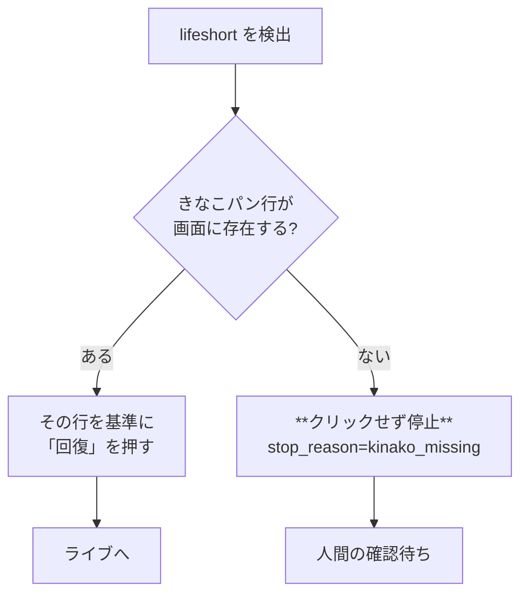
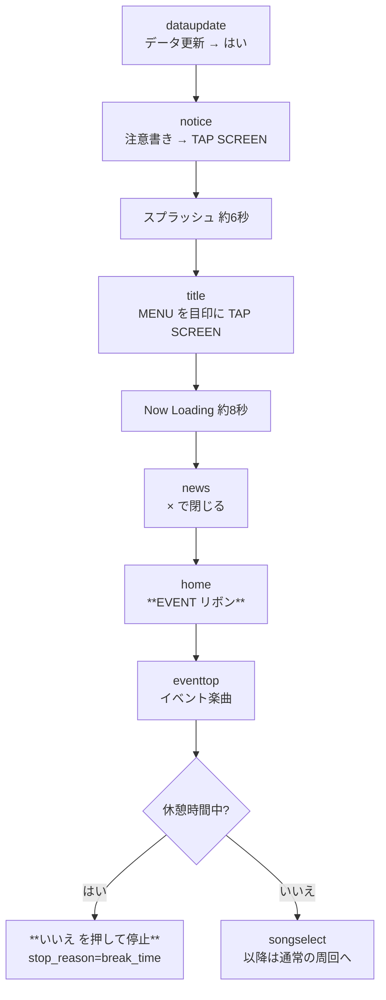

# 画面遷移仕様

このツールが認識する画面（状態）と、各画面で何をするかの仕様。**コードが真実**なので、
`tools/autolive.py` の `TEMPLATES` / `detect()` / `_loop()` を変更したら本書も更新すること
（更新手順は末尾「本書の保守」を参照）。

対象コミット時点の実装から機械的に抽出している。役割の違いに注意:

| 文書 | 中身 | 更新するとき |
|---|---|---|
| **本書** | 実装から抽出した**現在の仕様**（何をどの順で判定し、何をするか） | **実装を変えたとき** |
| [`navigation.md`](navigation.md) | イベント導線と実測座標 | イベントが変わったとき |
| [`device-findings.md`](device-findings.md) | なぜその実装になったかの経緯 | 新しい知見を得たとき |

---

## 1. 全体像

周回は3層のプロセスで動く。**画面遷移を扱うのは最下層の `autolive.py` だけ**で、
上位2層はプロセスの生死だけを見る。

```mermaid
flowchart TD
    R["run_until.sh<br/>指定時刻まで回す<br/>切断中は待機"]
    S["supervise_autolive.sh<br/>落ちたら再起動<br/>rc=42 なら再起動しない"]
    A["autolive.py<br/>画面認識と打鍵"]
    R -->|connected() が真なら起動| S
    S -->|残り時間ぶん起動| A
    A -->|rc=0 正常終了| S
    A -->|rc=42 安全停止| S
    S -->|安全停止/空転打ち切り| R
    R -->|接続あり＋要人手| STOP["runner 終了<br/>人間の確認待ち"]
    R -->|接続なし| WAIT["30秒待機して再確認"]
    WAIT --> R
```

- `connected()` は「ウィンドウが横向き」かつ「`detect()` が `menu` 以外」を接続とみなす。
  ゲームは常に横向きなので、**縦長＝ミラーリング切断ダイアログ**。
- `rc=42`（`EXIT_SAFE_STOP`）は「人間の確認が必要な停止」。再起動しても同じ画面で
  止まるだけなので、supervisor も runner も再起動しない。

## 2. 画面の判定方法

毎フレーム、次の順で判定する（`detect()`）。**順序が仕様の一部**で、入れ替えると誤判定する。

### 2.1 まず明るさで二分する

| 条件 | 意味 |
|---|---|
| 平均輝度 < `DARK_THRESH`(65) | ライブ中または PAUSE（暗い画面） |
| 平均輝度 ≧ 65 | メニュー・ダイアログ（明るい画面） |

**暗い側ではテンプレ照合を間引く**（`DARK_RECHECK_SEC` = 0.7 秒おき）。
毎フレーム照合すると打鍵ループが 3.3 FPS まで落ちる（実測。
[`device-findings.md`](device-findings.md)「打鍵ループが 3.3 FPS しか出ていなかった」）。

### 2.2 暗い側の判定



PAUSE の照合は `PAUSE_SEARCH_BOX`(0.25, 0.10, 0.75, 0.55) に限定している。
全画面照合は 1 回 147〜246ms かかり、打鍵ループを潰すため。

### 2.3 明るい側の判定順（上から順に評価）

| # | 状態 | 判定 | なぜこの位置か |
|---|---|---|---|
| 1 | `pause` | PAUSE 見出し | |
| 2 | `battery` | iOS バッテリー警告の「閉じる」 | 放置すると未知画面で停止する |
| 3 | `lifeshort` | 「ライフが足りません。」 | **課金事故防止のため最優先級**。盲目タップさせない |
| 4 | `friendreq` | EVENT RESULT の「申請する」 | |
| 5 | `replay` | 「連続ライブ」見出し | |
| 6 | `rankup` | 「RANK UP!」 | |
| 7 | `dldialog` | 「…をダウンロードします。」 | `closex` が誤マッチ(≈0.93)するので先に |
| 8 | `story` | 「ストーリー開放チケット…」 | ×が無く いいえ/はい なので `closex` より先に |
| 9 | `resumelive` | 「前回のライブを再開しますか？」 | シアン系ヘッダを持つので `cardx` より先に |
| 10 | `dataupdate` | 「データ更新のためタイトルへ戻ります」 | 同上 |
| 11 | `resendresult` | 「前回のライブ結果の送信が…」 | 同上 |
| 12 | `neterror` | 「通信エラーが発生しました。」→ **リトライ** | シアン系ヘッダを持つので `cardx` より先に。「諦める」を押すとその周回を落とす |
| 13 | `liveassist` | ライブアシスト選択 | `formation`・色検出より先に |
| 14 | `formation` | START ボタン | イベント装飾の帯を `cardx` と誤検出させないため |
| 15 | `breaktime` | 「休憩時間中はイベントPtを…」 | **必ず `eventtop` より先。** 背後の「イベント楽曲」が 0.943 で当たるため |
| 16 | `title` | **右下の MENU ボタン**（しきい値 0.92） | **`formation` より後ろ。** 編成画面の MENU が 0.889 で当たるため |
| 17 | `notice` | 起動時の注意書きの「TAP SCREEN」 | |
| 18 | `news` | ヘッダ「お知らせ」 | シアン系ヘッダを持つので `cardx` より先に |
| 19 | `eventtop` | 「イベント楽曲」ボタン | |
| 20 | `home` | EVENT ラベル帯（ベージュ側） | 同上 |
| 21 | `expresult` | 「獲得キャラEXP」 | カードの緑ヘッダを `cardx` が拾うので先に |
| 22 | `cardx` | シアン→緑のヘッダ帯を**色検出** | テンプレ非依存（端末非依存） |
| 23 | `closex` | ポップアップ右上の× | |
| 24 | `eventresult` | EVENT RESULT 見出し | |
| 25 | `result` | per-song「Result」 | 閾値 0.55 と低いが、誤検出しても中央タップのみで安全 |
| 26 | `songselect` | NEXT ボタン | |
| 27 | `friendselect` | フレンド選択 | |
| 28 | `formation` | START ボタン（再判定） | |
| 29 | `menu` | **どれにも当てはまらない** | **クリックせず待つ**。25秒で安全停止 |

**`menu` は「未知の明るい画面」**であり、絶対にクリックしない。課金ボタンの誤タップを
避けるための設計で、これを崩してはいけない。

## 3. 周回のメインループ

正常時の1周（約88〜130秒）。



各状態でやること:

| 状態 | 操作 | 補足 |
|---|---|---|
| `songselect` | 対象曲を選択 → EASY タブ → NEXT | 曲テンプレに一致しなければ**曲を変更しない**（安全側） |
| `friendselect` | **必ず最上段**の行をタップ | `match_topmost()`。最良スコアだと行が定まらない |
| `formation` | START | 直後 `CARDX_SUPPRESS_SEC` の間は `cardx` を無視する |
| `gameplay` | ノーツ到達を検出して打鍵 | 別章「4. ライブ中」参照 |
| `pause` | 固定位置の「再開」をクリック | 見出しテンプレの位置ではなくボタン位置 |
| `result` / `eventresult` / `expresult` | 中央タップで送る | |
| `cardx` | **背景**をタップして閉じる | ×の色検出位置は背景次第でぶれるため |
| `closex` | ×候補を順にタップ | |
| `friendreq` | 「申請する」 | ここでクリア数を計上する |
| `replay` | 「はい」 | 同じ曲を再開 |
| `lifeshort` | きなこパンで回復 | 別章「5. 課金事故を防ぐ設計」参照 |
| `dldialog` | 「ダウンロード」 | |
| `story` | **いいえ** | 周回を続ける |
| `liveassist` | 何も選ばず START | アイテム消費ゼロ |
| `battery` | 「閉じる」 | |
| `menu` | **何もしない** | 25秒で安全停止 |

## 4. ライブ中（`gameplay`）



- **円座標は機種で数十px ずれる**。`--auto-circles` で実測に補正し、
  `.autocal_circles.json` にキャッシュして次回起動時に即復元する。
  補正しないと MISS 51・グレード B まで落ちる（実測）。
- **キープアライブは必須**。無入力が続くとミラーリングがアイドル判定して PAUSE する。
- ループ末尾の `time.sleep(0.005)` は**外してはいけない**。外すと 48 FPS まで上がるが
  打鍵精度が有意に悪化する（PERFECT 54.5→37.5、3.5σ）。

## 5. 課金事故を防ぐ設計

**ステラストーン（課金アイテム）を絶対に消費しない**ことが最優先の要件。過去に一度、
実際に消費してしまった事故がある。



きなこパンが 0 個になると、ダイアログは**その行をグレーアウトせず行ごと消して上に詰める**。
そのため見出し基準の固定オフセットではステラの「回復」を直撃する。実機でステラ所持が
58→55→52 と減っていた。

対策は「**押す前にきなこパン行が実在することを画像で確認し、その行を基準に押す**」。
行が無ければクリックせず停止する。回帰テストは `tests/test_life_recover_safety.py`。

## 5.1 アプリ再起動からの自動復帰（2026-08-02 実機で実測）

毎日 4:00 前後に「データ更新のためタイトルへ戻ります」が割り込み、アプリがタイトルへ戻る。
以前はそこから先を認識できず、未知画面に 25 秒停滞して周回が終わっていた。



スプラッシュとローディングは未対応画面（`menu`）だが、いずれも 10 秒未満なので
`STUCK_STOP_SEC`=25 秒に収まる。

**守っている不変条件は3つ:**

1. **休憩時間中は「はい」を押さない。** 休憩中はイベント pt が一切入らないので、
   押すと LIFE だけ失う。必ず「いいえ」で戻って停止する。休憩時間帯は**ゲーム内の
   ユーザー設定で可変**なので、時刻からは判断せず、このダイアログだけを根拠にする
2. **`breaktime` を `eventtop` より先に判定する。** 休憩ダイアログは「イベント楽曲」
   ボタンを背後に残したまま出るため、`eventtop` のテンプレが 0.943 で当たる。
   逆順にするとダイアログの裏のボタンを押し続けて停滞する
3. **固定のウィンドウ相対座標を使わない。** イベントごとにボタン位置が動くので、
   すべてテンプレのマッチ位置を基準にクリックする
4. **背景を含むテンプレを目印にしない。** タイトルの背景は動画で、しかも**イベントごと
   に差し替わる**。旧イベントで切った「TAP SCREEN」は新しいタイトルで 0.85 を割り、
   2026-08-03 の 4:00 に**実際にここで 25 秒停滞して周回が止まった**。
   不透明で位置が動かない**右下の MENU ボタン**に替えたところ、タイトル5フレームで
   0.992〜1.000（白飛びするローディングでも 0.734 で当たらない）になった
5. **復帰の回数はフレームではなく episode で数える。** タイトルはローディングを挟んで
   何度も再検出されるので、毎フレーム数えると一瞬で上限に達して周回に戻れない

ホームの EVENT リボンは**2つ並ぶ**。ベージュのラベル帯の方が累計イベント（周回対象）。
下段のバナーは数秒で切り替わるカルーセルなので照合に使えない。
**ホームの「LIVE」から入ると通常ライブでイベント pt が付かない**（絶対規則3）ので、
`home` ハンドラは EVENT ラベルのマッチ位置以外を押さない。

復帰は `MAX_RECOVERS`=3 回までで、超えたら `recover_loop` で停止する。
回帰テストは `tests/test_restart_recovery.py`。

## 6. 安全停止

異常時は**必ず停止する**。再起動して同じ画面で止まり続けるより、止まって人間を待つ方が安全。

| `stop_reason` | 発火条件 | 典型的な原因 |
|---|---|---|
| `unknown_screen` | `menu` に 25 秒滞留 | 未対応のダイアログ／ミラーリング切断 |
| `cardx_stuck` | カードポップアップが閉じられず 25 秒 | 未対応のダイアログを `cardx` と誤認 |
| `popup_stuck` | ×が押せず 25 秒 | 同上 |
| `rankup_stuck` | RANK UP が閉じられず 25 秒 | |
| `result_stuck` | Result 送りが 30 秒進まない | システムダイアログの重なり |
| `gameplay_timeout` | 暗い画面が 240 秒続く | **ゲームのフリーズ**／ミラーリング切断 |
| `life_short_persist` | LIFE 不足が連続 6 回 | きなこパン枯渇の可能性 |
| `kinako_missing` | きなこパン行が見つからない | **きなこパン枯渇（ステラ誤消費の防止）** |
| `net_error` | 通信エラーのリトライが 8 回続く | 回線障害。人間が回線を確認する |
| `break_time` | 休憩時間の確認ダイアログが出た | **休憩中はイベント pt が入らない**（回すと LIFE の無駄） |
| `recover_loop` | 再起動からの復帰を 3 回試みても戻れない | 復帰導線のどこかが変わった |

いずれも `EXIT_SAFE_STOP`(42) で終了し、スクリーンショットを `/tmp/i7dbg/` に保存する。

## 7. 未対応の画面が出たときの直し方

実機で新しいダイアログに当たると `unknown_screen` か `cardx_stuck` で止まる。手順:

1. `/tmp/i7dbg/stuck_*.png` / `cardx_stuck_*.png` を開いて画面を特定する
2. その画面**固有の文言**を切り出して `assets/templates/<name>.png` に保存する
   （機種で見た目が変わるなら `<name>_16.png` のような variant を併用。
   `load_templates()` が `<stem>_*.png` を自動で読む）
3. `TEMPLATES` に追加し、`detect()` の**適切な位置**に判定を入れる
   - シアン系ヘッダを持つダイアログは必ず `cardx` **より前**に置く
   - そうしないと背景タップで閉じようとして必ず停滞する
4. `_loop()` にハンドラを追加する。ボタンはテンプレのマッチ位置からの
   **アンカーオフセット**で押す（固定座標は機種差で外れる）
5. 停止時のフレームを `tests/frames/` に資産化し、回帰テストを書く
   （`tests/test_detect_dialogs.py` が前例。**着弾点が正しいボタンに載ること**まで検証する）

**左右の取り違えが損失に直結する選択肢**（「諦める」「ステラで回復」など）は、
必ず着弾点の矩形をテストで固定すること。

## 8. 本書の保守

次の変更をしたら本書を更新する。

| 変更 | 更新する箇所 |
|---|---|
| `TEMPLATES` に状態を追加・削除 | 2.3 の判定順の表 |
| `detect()` の判定順を変更 | 2.3（**順序は仕様**） |
| `_loop()` のハンドラを追加・変更 | 3 の操作表、必要なら 1〜4 の図 |
| `stop_reason` を追加 | 6 の表 |
| 上位スクリプト（runner/supervisor）の役割変更 | 1 の図 |

抽出は機械的にできる。

```bash
# 判定順
sed -n '/def detect(self/,/^    def [a-z]/p' tools/autolive.py | grep -E 'return "|m\("'
# ハンドラ
grep -nE 'elif state == "|elif state in \(' tools/autolive.py
# 停止理由
grep -oE 'self\.stop_reason = "[a-z_]+"' tools/autolive.py | sort -u
```

図は Mermaid で書いてある。GitHub でそのまま描画される。
