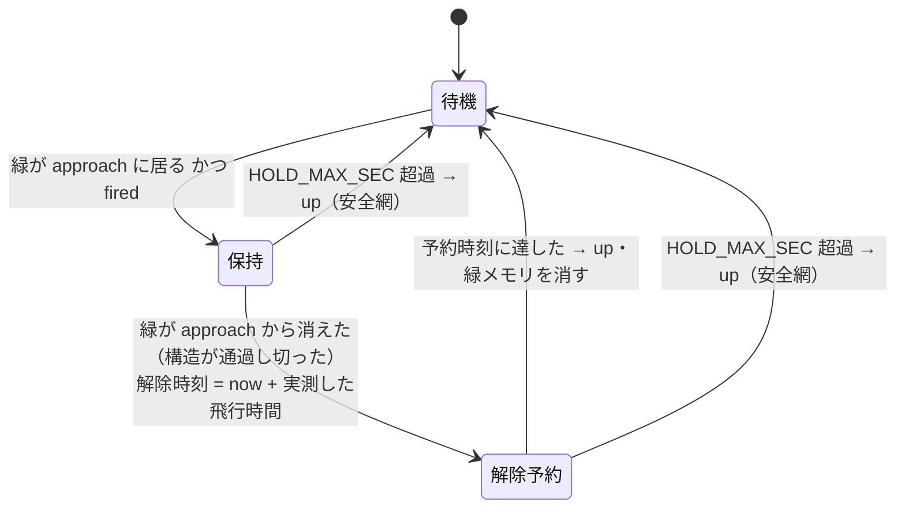

# 緑ノーツの長押し対応 設計書

- 日付: 2026-08-04
- 状態: **実装済み・既定 OFF のまま打ち切り**（2026-08-04 ユーザー判断）
- 対象: `tools/autolive.py` の打鍵エンジン（`_gameplay_timing` とその周辺）

## 0. 結論（2026-08-04）

**実装は完了して動作も確認したが、有効化はしない。既定 OFF のまま据え置く。**

打ち切りの理由は実測値。REINCARNATION で 1 ライブを計測したところ:

| | |
|---|---|
| 緑ノーツ | **6 件** |
| 全ノーツ | 約 180（打鍵 327 回） |
| **緑の比率** | **約 3.3%** |
| ホールドできた | 4 件（67%）。誤検出ゼロ |
| 取り逃した | 2 件（円3→円0 の 2.81 秒差ペア。曲の終盤） |

**完璧に処理しても寄与は全体の 3.3% にとどまる。** 現状すでに SS グレードであり、
ここから先の詰め（抑制秒数の調整、A/B 測定に各 25 ライブ）は費用対効果が見合わない。

**コードは残す。** 既定 OFF なので周回に影響しない。緑の比率が高い曲のイベントが
来たら `--green-hold` で有効化して測り直せる。有効化する前には必ず
`result_log.py` で MISS/BAD が悪化しないことを確認すること。

未解決のまま残した点:

- 取り逃し 2 件の原因は**タップ直後 0.45 秒の抑制**（`GREEN_SUPPRESS_SEC`）が
  疑わしいが未検証。ピークは 895px と 1176px と最も明るい部類なので検出力の問題ではない
- 最初のホールドが 0.08 秒で終わることがあり、**頭ではなく尾を掴んでいる可能性**がある

## 1. 背景

ノーツには色ごとに操作の意味がある（`docs/device-findings.md`）。

| 色 | 操作 | 現状 |
|---|---|---|
| 白 | タップ | 実装済み |
| 赤 | フリック | 実装済み（`--flick`。MISS 14→3 の実績） |
| **緑** | **次の緑まで長押し** | **未実装（頭だけタップ＝部分点）** |
| 青 | 次の青までスライド長押し | 未実装（本書の対象外） |

緑は現在ただの1タップとして処理され、長押しの持続点を丸ごと捨てている。

## 2. 仕様（2026-08-04 ユーザー確認）

- **長押しの終端は、開始したのと同じ円に来る。** レーンをまたがない
- **緑は2つで1組。** 1→2 で一つの長押し、3→4 で次の長押し。連続した1本にはならない

## 3. 動かせない制約

**合成入力はカーソル1点しかない。** `_press` は `CGWarpMouseCursorPosition` + マウスイベントで、
マウスは1つしかない。**ある円を押しながら別の円をタップすることは物理的にできない。**

したがって長押し中は他レーンのノーツを取れない。実装も現状 `return` して他の円を見ていない。

### 3.1 採用する方針

長押し中に他レーンへノーツが来ることは**ある**（ユーザー確認）。それでも:

**案A（他レーンは捨てる）を採用する。** EASY ではノーツ密度が低く、長押し中に他レーンへ
来る確率が低いというユーザー判断による。

検討した代案（採らない）:

- **案B（他ノーツが来たら離す）**: 長押しを中断して他をタップする。現状より単調に良いが、
  実装が複雑になる。**実測で MISS が悪化したらここへ寄せる**
- **案C（現状維持）**: 緑の持続点を捨て続ける

## 4. 検出の設計

### 4.1 なぜ色でしか判定できないか

**到達点ではノーツが白飛びして色が消える**（`docs/device-findings.md`）。そのため色は
「飛行中」にしか見えない。赤フリックは円と中心の間 `FLICK_APPROACH_FRAC`(0.65) の地点で
検色しており（`_approach_red`）、これが実証済みの唯一の手段。

**さらに長押し中は輝度が一切使えない。** 押下で円が光り続けるので `fired[i]` が立ちっぱなしになり、
「次のノーツが来た」と区別できない。旧 `--holds`（輝度の持続で判定）が壊れた原因もこれ。

→ **開始も解除も、approach 点の色だけで決める。**

### 4.2 判定文字「GOOD」との衝突（実測で判明）

gameplay コーパス 78 枚 × 4 円 = 312 サンプルで緑の発火を調べたところ 1 件当たった。
中身を見ると**緑ノーツではなく判定文字「GOOD」**だった（ROI 平均 RGB 132,185,129）。

GOOD は 1 ライブに約 110 回出る。これを緑と誤認すると**8 秒の偽ホールドを乱発**して
案A では致命傷になる。赤で問題化していないのは、偽フリックのコストがタップ1回ぶんで
済むから。**緑は赤より厳しくする必要がある。**

### 4.3 対策 — approach 点を 0.70 へ、加えて白率で弾く

approach 位置を振って実測した（コーパスの当該フレーム／赤ノーツ）:

| frac | GOOD 文字 | 赤ノーツの R−G | 白率 |
|---|---|---|---|
| 0.65 | **ROI に重なる**（G−R=53） | 70 | 0.16 |
| **0.70** | **外れる** | **82** | 0.00 |
| 0.75 | 外れる | 29（色が薄い） | 0.00 |
| 0.80 以上 | 外れる | 0（白飛び） | 0.00 |

使える窓は 0.65〜0.70 しかなく、judgment 文字を避けられるのは **0.70** だけ。
しかも色はむしろ濃くなる。

**白率による判別は撤回した（2026-08-04 実測）。** 「判定文字は白い字を含むので白率で弾ける」
と想定していたが、実物の緑ノーツの白率は **0.00〜0.40** で GOOD 文字の 0.37 と完全に重なった。
ノーツの頭にも白いハイライトがあるため。

**代わりに「緑画素の数」を使う。** これは 8 倍の差がついて明確に分かれる。

| | 緑画素数 | 明るい画素の G−R 平均 | 白率 |
|---|---|---|---|
| **本物の緑ノーツ**（実測16件） | **700〜1064** | 28〜52 | 0.00〜0.40 |
| 背景・装飾のノイズ（97件） | **21〜85** | −1〜11 | — |
| GOOD 文字 | （位置で除外） | 53 | 0.37 |

```python
GREEN_APPROACH_FRAC = 0.70   # 緑の検色点（赤の 0.65 とは別。判定文字 GOOD を避ける）
GREEN_MIN_PX = 300           # approach ROI 内の緑画素数（本物 700〜1064 / ノイズ 21〜85）
GREEN_REL_PX = 150           # 解除側のしきい（ヒステリシス）
GREEN_MEMORY = 0.35          # 緑を見てから、この秒内に fired したらホールド扱い（赤と同値）
```

緑画素の定義: `(G-R > 25) and (G-B > 25) and (G > 100)` を満たす画素の数。

**赤の `FLICK_APPROACH_FRAC`(0.65) は変えない。** 実績のある値を触らない。

### 4.4 実測で分かったホールドの実体（2026-08-04・REINCARNATION）

**緑は2つが緑の帯で繋がり、同じ放射線上を同じ円へ飛ぶ。** 仕様どおり。
approach 点での緑画素の推移は「立ち上がり → 山（頭） → 谷（帯） → 山（尾） → 消失」。

**構造が approach 点を通過し切る時間は 0.25〜0.42 秒**（3ライブ・16件すべて）。
ユーザー申告の 7 秒とは桁が違う。**ただし曲・イベントによって変わるので、
実装は長さに依存しない作りにする。**

緑ノーツは **1 ライブに約 5.3 個**（約180ノーツ中＝3%）。この曲では寄与は小さいが、
**イベントごとに曲が変わり緑の比率も変わる**ため、汎用に実装する（ユーザー判断）。

### 4.5 `TRANSIT_SEC` は実行時に自己較正する

approach 点から円までの飛行時間は、定数で持たずに**ホールドごとに実測する**。

緑が approach に現れた時刻 `green_since[i]` と、その円が `fired` した時刻の差が、
まさにその飛行時間。ホールド開始時に計算して、そのホールドの解除に使う。
機種・ウィンドウサイズ・レーン距離の差（実測 1.34 倍）を自動で吸収する。

## 5. 状態機械（円ごと）

**解除は「次の緑を数える」のではなく「緑が approach から消えた」で判定する。**
構造全体（頭＋帯＋尾）が通過し切った瞬間が分かるので、**ホールドの長さに一切依存しない**。
0.3 秒でも 7 秒でも同じコードで動く。



保持中は毎フレーム `move` を送る（genuine 入力を維持して PAUSE を防ぐ。既存と同じ）。

**解除時に緑メモリを明示的にクリアする。** 終端の緑をそのまま次の開始と誤認しないため。
`NOTE_DEBOUNCE_SEC`(0.18) だけでは、`GREEN_MEMORY`(0.35) との差の隙間が残る。

## 6. 安全策

- **`HOLD_MAX_SEC` = 8 秒**（`--hold-max-sec` で上書き可）。誤検出しても必ず離す。
  実測した長さは 0.3〜0.5 秒だが、曲によって長い可能性があるので上限は広く取る
- **既定 OFF の `--green-hold`**。supervisor には実測で良化を確認してから入れる
- **解除理由をログに出す**:
  ```
  ホールド解除 円1（2.31s, 対の緑を検出）   ← 正常
  ホールド解除 円1（8.00s, 上限）           ← 検出失敗
  ```
  上限による解除が混じっていれば緑の検出が効いていない証拠。1 ライブ回せば判別できる。
  **上限解除が出るうちは既定 OFF のままにする**

`HOLD_MAX_SEC` は未検証の `--predict` 経路とも共有しているが、そちらも既定 OFF なので影響しない。

## 7. テスト（`tests/test_green_hold.py` を新設・実機不要）

1. `_approach_green` が判定文字「GOOD」のフレームで **0 に近い値**を返すこと（回帰の要）
2. 実機で撮った緑ノーツのフレームで `GREEN_MIN_PX` を超えること
3. 緑の検色点が赤と別であること（`GREEN_APPROACH_FRAC != FLICK_APPROACH_FRAC`）
4. 状態機械: 合成フレームで 待機→保持→解除予約→待機 を一巡すること
5. `HOLD_MAX_SEC` 超過で必ず `up` が送られること
6. 解除時に緑メモリがクリアされること（終端の緑で再ホールドしない）
7. `--green-hold` の既定が OFF であること
8. gameplay コーパス 312 サンプルでの緑の発火率が 0 であること（現状 0.3%＝GOOD 文字のみ）

## 8. 効果測定

`tools/ops/result_log.py` で分布を貯めて比較する。**単発では ±5% の誤差に埋もれる。**

**必須条件: MISS/BAD を悪化させないこと**（ユーザー方針）。悪化したら案B へ寄せる。

現行のベースライン（Don't Analyze Me / EASY / ブースト3倍）:
PERFECT 67 / GOOD 110 / BAD 2 / MISS 5 / SCORE 357,759 / グレード SS

## 9. リスク

| リスク | 対応 |
|---|---|
| ~~緑ノーツの実物を持っていない~~ | **解消済み（2026-08-04 実機で3ライブ計測）** |
| 計測したのが REINCARNATION で、周回曲の Don't Analyze Me ではない | 長さに依存しない実装にしたので曲が変わっても動く。緑の比率だけは曲ごとに違う |
| 判定文字以外にも緑の誤検出源があるかもしれない | 較正時に採ったフレーム全部で発火率を測る。テスト8で回帰を固定 |
| 8 秒の偽ホールドで MISS が急増する | 解除理由のログで即座に判別できる。既定 OFF なので周回には影響しない |
| `TRANSIT_SEC` がレーンごとに違う（移動距離が 1.34 倍ばらつく） | まず単一値で実装し、精度が出なければレーン別にする |

## 10. 実装の順序

1. ~~実機で緑ノーツを実測する~~ **完了（2026-08-04）**
2. `_approach_green` を実装し、コーパスと実測フレームで誤発火 0 を確認
3. 状態機械を `_gameplay_timing` に組み込む（`--green-hold` 既定 OFF）
4. `tests/test_green_hold.py`
5. 実機で1ライブ回し、**解除理由のログ**を確認
6. `result_log.py` で分布を貯めて A/B。MISS/BAD が悪化しないことを確認してから supervisor へ
